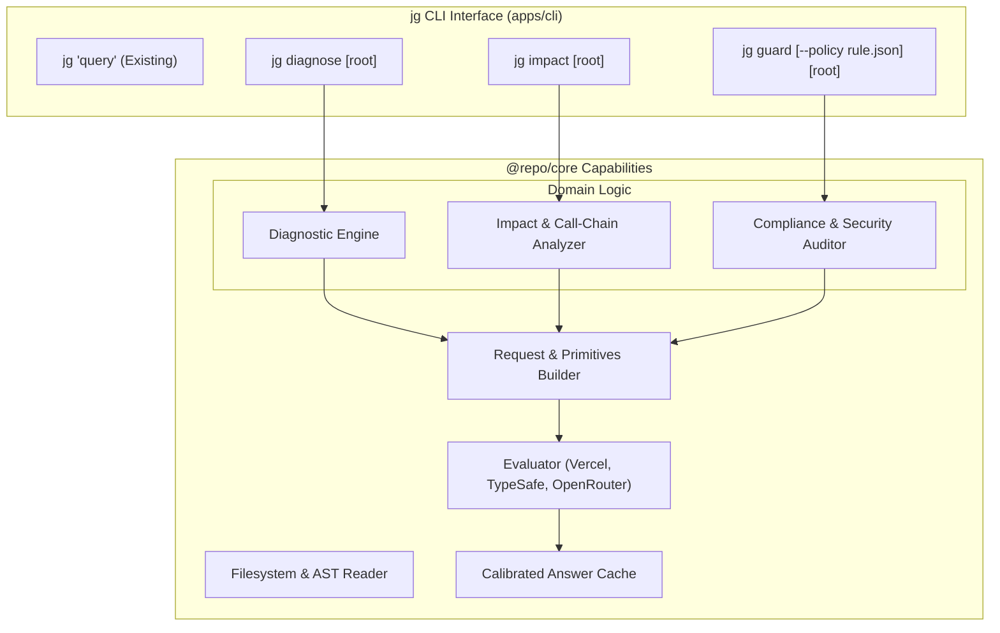

# Specification: Advanced Semantic Code Intelligence with TypeSafe Jev

## Context and Vision
`jevgrep` currently leverages TypeSafe's System One model (**Jev**) primarily as an exploratory heuristic: traversing the repository file tree and selecting source declarations relevant to a natural-language question.

However, Jev is a fast (70–500ms), calibrated probabilistic decision engine trained with Reinforcement Learning for Calibrated Decisions (RLCD). It returns typed, structured outputs (Booleans, Choices, Scores with confidence distributions) rather than generative text.

This specification outlines the evolution of `jevgrep` from a search utility into a full **Semantic Code Intelligence Suite** by introducing three new capabilities exposed through both `@repo/core` and the `jg` CLI:
1. **`jg diagnose`**: Root-Cause Bug Locator & Stack Trace Diagnostic
2. **`jg impact`**: Semantic Blast Radius & Breaking Change Analyzer
3. **`jg guard`**: Semantic Architectural & Security Compliance Guardrail

---

## Architecture and Seams

---

## Staged Implementation Plan (Ladder of Slices)

### Slice 1: Diagnostic & Root-Cause Bug Locator (`jg diagnose`)
- **Seam**: `@repo/core/diagnostic.ts` & `apps/cli/src/commands/diagnose.ts`.
- **Inputs**: Error message / stack trace / test failure log (passed via stdin or argument), target project root.
- **Jev Primitive**:
  - `type: "boolean"` for candidate file/block culpability: *"Is this declaration the direct root cause of the provided exception, or does it merely experience secondary propagation?"*
  - `type: "score"` (0.0 to 1.0) calibrated confidence score for anomaly likelihood.
- **Deliverables**:
  - `parseTrace(input: string)`: Extracts mentioned filenames, line numbers, and error signatures.
  - `diagnoseFailure(options: DiagnosticInput, evaluator: Evaluator)`: Queries Jev on candidate suspect declarations vs stack trace context.
  - CLI subcommand `jg diagnose "ZeroDivisionError: division by zero" ./src`.
  - Unit tests verifying mock trace evaluation against candidate faulty functions.

### Slice 2: Semantic Blast Radius & Breaking Change Risk (`jg impact`)
- **Seam**: `@repo/core/impact.ts` & `apps/cli/src/commands/impact.ts`.
- **Inputs**: Target symbol/declaration (or git diff), repository root.
- **Jev Primitive**:
  - `type: "choice"`: Categorize risk level (`"no_impact"`, `"non_breaking_behavioral"`, `"breaking_interface"`, `"cascading_failure"`).
  - Instruction: *"Given the signature/behavior change of symbol X in state.target, does caller Y in state.caller require modification or break contract expectations?"*
- **Deliverables**:
  - Declaration callers finder utilizing existing AST parser (`packages/core/src/source.ts` and `call-context.ts`).
  - Batch evaluation of callers using calibrated Choice evaluation.
  - CLI subcommand `jg impact "UserService.updateUser" .`.
  - Output summary ranking callers by severity of potential impact.

### Slice 3: Semantic Architectural & Security Guardrails (`jg guard`)
- **Seam**: `@repo/core/guard.ts` & `apps/cli/src/commands/guard.ts`.
- **Inputs**: Source diff or staged files, customizable semantic policy rules (JSON/YAML).
- **Jev Primitive**:
  - Multi-question boolean matrix:
    - `q_pii`: *"Does this code log, expose, or transmit unmasked credentials, tokens, or PII?"*
    - `q_layering`: *"Does this component directly bypass domain service layers and query the database?"*
    - `q_error_suppression`: *"Does this code catch critical errors and silently swallow them without telemetry or logging?"*
- **Deliverables**:
  - Default security & architecture rule definitions.
  - Evaluation runner scoring violations against confidence threshold (e.g. `confidence > 0.85`).
  - CLI subcommand `jg guard [root]` exiting with non-zero code on violation (ideal for CI/CD gates).
  - Integration tests for true positive and true negative detection samples.

### Slice 4: Agent Skills & CLI Unification
- **Seam**: `apps/cli/src/index.ts`, `skills/jevgrep/SKILL.md`, and `.agents/skills/jevgrep/SKILL.md`.
- **Deliverables**:
  - Update `jg --help` and argument router to handle `diagnose`, `impact`, and `guard`.
  - Update agent `SKILL.md` so AI coding agents know when and how to invoke each capability during debugging, refactoring, and code review workflows.
  - End-to-end smoke verification on Windows, macOS, and Linux.

---

## Verification and Safety Invariants
1. **Strictly Typed & Zero Hallucination**: No generative prose; all results must be based on calibrated probabilities and exact source spans.
2. **Deterministic Parity**: Output format follows existing Jevgrep conventions (`stdout`-only, structured lead annotations).
3. **Local Cache Ownership**: All evaluations must participate in `EvaluationCache` to preserve tokens and eliminate repeated API requests.
4. **Graceful Degradation**: Clear CLI exit codes (0 = clean, 1 = error/fatal, 2 = violations/anomalies detected, 130 = aborted).

---

## Implementation Status
- [x] **Slice 1: `jg diagnose`** (Root-cause bug locator supporting Node.js, Python, standard PHP, and Laravel Ignition stack traces)
- [x] **Slice 2: `jg impact`** (Semantic blast radius and breaking change risk analyzer across symbol callers/consumers)
- [x] **Slice 3: `jg guard`** (Semantic architecture and security audit with calibrated violation detection)
- [x] **Slice 4: CLI Unification & Agent Skills** (Unified argument routing, multi-command `--help`, updated SKILL.md in project & global Antigravity, comprehensive README docs, 100% passing tests & typecheck)
